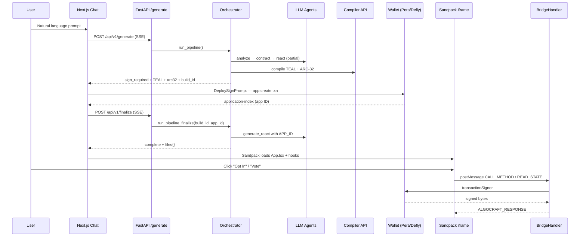

# Algovibe (AlgoCraft) — System Architecture

This document describes **how Algovibe turns natural language into a deployable Algorand dApp with a live in-browser preview**. It covers the full stack: FastAPI backend agents, SSE streaming, wallet-signed deployment, Sandpack iframe preview, and the parent↔iframe **bridge** that executes real on-chain transactions without putting private keys inside generated code.

**Related docs:** [README.md](README.md) · [docs/SETUP.md](docs/SETUP.md) · [docs/SMART_CONTRACTS.md](docs/SMART_CONTRACTS.md) · [docs/API.md](docs/API.md) · [CONTRIBUTING.md](CONTRIBUTING.md)

---

## Table of contents

1. [Product overview](#1-product-overview)
2. [Repository layout](#2-repository-layout)
3. [End-to-end data flow](#3-end-to-end-data-flow)
4. [Two-phase pipeline (generate → sign → finalize)](#4-two-phase-pipeline-generate--sign--finalize)
5. [Backend architecture](#5-backend-architecture)
6. [Frontend architecture](#6-frontend-architecture)
7. [Live preview: Sandpack + bridge](#7-live-preview-sandpack--bridge)
8. [Wallet and deployment](#8-wallet-and-deployment)
9. [Export vs preview](#9-export-vs-preview)
10. [Algorand-specific design](#10-algorand-specific-design)
11. [Protocols and RAG](#11-protocols-and-rag)
12. [Configuration and environment](#12-configuration-and-environment)
13. [Known limitations and extension points](#13-known-limitations-and-extension-points)

---

## 1. Product overview

**Algovibe** is a text-to-dApp builder for **Algorand testnet/mainnet**:

| Stage | What happens | Where it runs |
|-------|----------------|---------------|
| **Spec** | User prompt → structured contract spec (methods, global/local state, UI hints) | Backend LLM (`architect.py`) |
| **Contract** | Spec → Puya TypeScript/Python source | Backend LLM (`algorand_agent.py`) + sanitizer |
| **Compile** | Source → TEAL + ARC-32 JSON | External compiler HTTP API (`compiler_client.py`) |
| **Deploy** | User signs **application create** in parent app wallet | `DeploySignPrompt.tsx` + Pera/Defly/etc. |
| **UI** | Spec + ARC-32 → `App.tsx` + hooks | Backend LLM (`react_agent.py`) + templates |
| **Preview** | Generated React runs in Sandpack; txs go through **BridgeHandler** | `SandpackPreview.tsx` + `BridgeHandler.tsx` |
| **Export** | Zip with standalone wallet hooks (no iframe bridge) | `ExportButton.tsx` + `export-templates.ts` |

**Critical security model:** Generated dApp code in the iframe **never** holds mnemonics. It `postMessage`s to the parent; the parent uses `@txnlab/use-wallet-react` to sign.

---

## 2. Repository layout

```
Algovibe/
├── backend/                    # FastAPI + LangGraph-style pipeline
│   ├── app/
│   │   ├── main.py             # FastAPI app, CORS, routers
│   │   ├── api/routes/
│   │   │   ├── generate.py     # POST /api/v1/generate, /finalize (SSE)
│   │   │   ├── protocols.py    # Ecosystem protocol list/suggestions
│   │   │   └── publish.py      # Vercel publish helpers
│   │   ├── agents/
│   │   │   ├── orchestrator.py # Pipeline state machine + streaming
│   │   │   ├── architect.py    # Prompt → contract spec JSON
│   │   │   ├── algorand_agent.py # Spec → .algo.ts / .py + sanitizer
│   │   │   └── react_agent.py  # Spec → App.tsx + hook templates
│   │   ├── services/
│   │   │   ├── compiler_client.py
│   │   │   ├── deployment_generator.py
│   │   │   └── build_store.py    # Persist state between sign & finalize
│   │   ├── rag/                  # Embeddings + retriever (often disabled in demo)
│   │   └── core/
│   │       ├── config.py
│   │       └── llm.py            # OpenRouter / OpenAI wrapper
│   └── build_sessions.json       # Runtime: pending builds (gitignored typically)
│
├── frontend/                   # Next.js App Router
│   ├── app/
│   │   ├── page.tsx            # Landing
│   │   └── chat/page.tsx       # Main builder UI
│   ├── components/
│   │   ├── chat/               # ChatLayout, PromptInput, WalletButton
│   │   └── preview/            # Sandpack, BridgeHandler, DeploySignPrompt
│   └── lib/
│       ├── api.ts              # SSE client (generateDApp, finalizeDeployment)
│       ├── store.ts            # Zustand global build state
│       ├── bridge-protocol.ts  # iframe ↔ parent message types
│       ├── preview-bridge-hooks.ts  # Canonical Sandpack useAlgorand (patched in)
│       ├── export-templates.ts # Standalone export useAlgorand
│       ├── abi-tx.ts           # ARC-32 onComplete resolution
│       └── serialize.ts        # bigint coercion, sameAppId
│
└── generated/                  # User-exported test projects (not used at runtime)
```

---

## 3. End-to-end data flow



---

## 4. Two-phase pipeline (generate → sign → finalize)

Algovibe **intentionally pauses** after compilation so deployment uses the **user's wallet** in the browser, not a server hot wallet.

### Phase A: `POST /api/v1/generate`

FastAPI returns **Server-Sent Events** (`text/event-stream`):

```python
# backend/app/api/routes/generate.py
@router.post("/generate")
async def generate_dapp(request: GenerateRequest):
    return StreamingResponse(
        event_generator(request.prompt, request.framework, request.network, request.user_wallet),
        media_type="text/event-stream",
        headers={
            "Cache-Control": "no-cache",
            "Connection": "keep-alive",
            "X-Accel-Buffering": "no",
        },
    )
```

The orchestrator runs through analysis, contract generation, and compile, then **stops** and emits `sign_required`:

```python
# backend/app/agents/orchestrator.py (excerpt)
build_id = str(uuid.uuid4())
save_build(build_id, state)

yield {
    "step": "sign_required",
    "message": "Click button to build and sign transaction over Pera / Defly",
    "build_id": build_id,
    "unsigned_tx": "client-side",
    "approval_teal": state.get("approval_teal", ""),
    "clear_teal": state.get("clear_teal", ""),
    "arc32_spec": state.get("arc32_spec", {}),
    "contract_code": state.get("contract_code", ""),
    "contract_filename": state.get("contract_filename", "contract"),
    "framework": state.get("framework", "puyats"),
}
return  # React generation does NOT run yet
```

**Build state persistence** (`build_store.py`) writes the full `PipelineState` to `backend/build_sessions.json` so a server reload does not lose the TEAL between sign and finalize:

```python
def save_build(build_id: str, state: dict) -> None:
    data = _load_all()
    data[build_id] = { **state, "_saved_at": time.time() }
    _save_all(data)
```

### Phase B: User signs deploy (client-only)

`DeploySignPrompt` compiles TEAL via algod, builds `ApplicationCreate`, signs with `transactionSigner`, reads `application-index` from confirmation, then calls the store:

```typescript
// frontend/components/preview/DeploySignPrompt.tsx (excerpt)
const appId = confirmed['application-index'] ?? confirmed.applicationIndex
await completeDeployment(pendingSignature.buildId, appId.toString())
```

### Phase C: `POST /api/v1/finalize`

```python
# backend/app/api/routes/generate.py
async def finalize_event_generator(build_id: str, package_id: str):
    app_id = int(package_id)
    async for event in run_pipeline_finalize(build_id, app_id):
        yield f"data: {json.dumps(event)}\n\n"
```

```python
# backend/app/agents/orchestrator.py
async def run_pipeline_finalize(build_id: str, app_id: int) -> AsyncGenerator[dict, None]:
    state = load_build(build_id)
    state["app_id"] = app_id
    yield {"step": "deployed", "message": "Contract deployed!", "app_id": app_id}
    state = await generate_react_node(state)  # Only now: App.tsx + hooks
    for event in state["events"]:
        yield event
    delete_build(build_id)
```

The frontend consumes finalize the same way as generate (`finalizeDeployment` in `api.ts`).

---

## 5. Backend architecture

### 5.1 Pipeline state

All steps share a typed dict `PipelineState`:

```python
# backend/app/agents/orchestrator.py
class PipelineState(TypedDict):
    prompt: str
    framework: str             # "puyapy" | "puyats" | "tealscript"
    network: str
    user_wallet: Optional[str]
    template_type: str
    contract_spec: dict
    contract_docs: List[str]
    sdk_docs: List[str]
    contract_code: str
    contract_filename: str
    approval_teal: Optional[str]
    clear_teal: Optional[str]
    arc32_spec: Optional[dict]
    compile_logs: List[str]
    compile_retry_count: int
    deployment_code: Optional[str]
    app_id: Optional[int]
    react_files: Dict[str, str]
    current_step: str
    error: Optional[str]
    events: List[dict]
```

LangGraph `StateGraph` defines the **logical** graph (analyze → RAG → generate → compile → deploy code → SDK RAG → react), but **`run_pipeline` implements a custom streaming loop** for compile retries and the sign pause.

### 5.2 Step 1 — Architect (`architect.py`)

**Input:** raw user prompt (+ optional protocol enrichment from frontend).

**Output:** `AnalysisResult`:

```python
class AnalysisResult(TypedDict):
    template_type: str  # e.g. "voting", "crowdfunding"
    spec: dict          # methods, global_state, local_state, ui_requirements, ...
```

The architect system prompt constrains:

- Max ~3–5 ABI methods
- Algorand types (`uint64`, `Address`, local/global/box state)
- Fixed category names (`voting`, `nft`, `dao`, …)

```python
async def analyze_prompt(prompt: str) -> AnalysisResult:
    response = await generate_completion(
        system_prompt=ARCHITECT_SYSTEM_PROMPT,
        user_prompt=prompt,
        response_format="json",
    )
    # ... parse JSON into template_type + spec
```

### 5.3 Step 2 — Algorand contract agent (`algorand_agent.py`)

**Class:** `AlgorandAgent(framework="puyats"|"puyapy"|"tealscript")`

Responsibilities:

1. **LLM generation** with framework-specific system prompt, few-shot examples, and golden skeleton on first attempt.
2. **Pre-compile sanitizer** (`_sanitize_code`) — deterministic regex fixes before HTTP compile.
3. **Retry loop** — orchestrator re-invokes with `previous_code` + `error_context` (up to 5 compile retries).

**Banned patterns** (enforced in prompt + sanitizer), example:

```
❌ @abimethod({ allowActions: 'OptIn' }) on cast_vote when optInToApplication() exists
❌ boolean, string imported from @algorandfoundation/...
❌ sendPayment() — use itxn.payment({...}).submit()
```

**Sanitizer rule #9** (voting / local state fix):

```python
# backend/app/agents/algorand_agent.py (excerpt)
if 'optInToApplication' in code:
    code = re.sub(
        r"@abimethod\(\s*\{\s*allowActions\s*:\s*['\"]OptIn['\"]\s*\}\s*\)",
        "@abimethod()",
        code,
    )
```

**Correct voting pattern** the agent is steered toward:

```typescript
public optInToApplication(): void {
  this.voted(Txn.sender).value = Uint64(0)
}

@abimethod()  // NoOp after separate opt-in
public cast_vote(candidate_id: uint64): void {
  assert(this.voted(Txn.sender).value === Uint64(0), 'User already voted')
  // ...
}
```

### 5.4 Step 3 — Compiler client (`compiler_client.py`)

HTTP POST to `settings.compiler_server_url`:

| Framework | Endpoint | Body |
|-----------|----------|------|
| `puyats` | `/compile-puyats` | `{ "codeBase64": "..." }` |
| `puyapy` | `/compile-puyapy` | `{ "codeBase64": "..." }` |
| `tealscript` | `/compile-tealscript` | `{ "code": "..." }` |

**Returns:** `CompilerResult` with `approval_teal`, `clear_teal`, `arc32_spec`, logs, error.

ARC-32 includes:

- `contract.methods[]` — ABI method names and arg types
- `hints` — e.g. `"cast_vote(uint64)void": { "call_config": { "no_op": "CALL" } }`
- `state.global` / `state.local` — schema sizes for app create

### 5.5 Step 4 — Deployment code generator (`deployment_generator.py`)

Produces a **reference** JS module string (mostly legacy); **actual deploy** is implemented in `DeploySignPrompt.tsx` mirroring the same algod compile + `makeApplicationCreateTxnFromObject` flow.

### 5.6 Step 5 — React agent (`react_agent.py`)

**`generate_react_frontend()`** calls the LLM with:

- Contract spec JSON
- Deployed `APP_ID` (`package_id` from finalize)
- UI requirements from architect
- Strict rules in `REACT_AGENT_SYSTEM_PROMPT` (camelCase `useContract()` methods, opt-in flow, no `JSON.stringify` on chain state, etc.)

**`build_file_structure()`** assembles Sandpack files:

```python
def build_file_structure(app_code: str, package_id: str, arc32_spec: any = None) -> ReactGenerationResult:
    files = {
        "/App.tsx": app_code,
        "/index.css": DEFAULT_CSS,
        "/hooks/useAlgorand.ts": USE_ALGORAND_HOOK_TEMPLATE,
        "/hooks/useContractState.ts": USE_CONTRACT_STATE_HOOK_TEMPLATE,
    }
    if arc32_spec:
        files["/contract.arc32.json"] = json.dumps(arc32_spec, indent=2)
    files["/hooks/useContract.ts"] = generate_contract_sdk(arc32_spec or {}, package_id)
    return ReactGenerationResult(files=files, ...)
```

**`generate_contract_sdk()`** auto-builds `useContract.ts`:

```typescript
// Generated pattern (conceptual)
export const APP_ID = 762582288;

export const useContract = () => {
    const { callMethod, readState, loading, error, success } = useAlgorand();
    return {
        castVote: async (candidate_id: number) =>
            callMethod({ method: 'cast_vote', args: [candidate_id], app_id: APP_ID }),
        readState: () => readState(APP_ID),
        loading, error, success
    };
};
```

Lifecycle methods (`createApplication`, `optInToApplication`, …) are **excluded** from the hook; opt-in uses magic method `__optIn__` handled by the bridge.

### 5.7 Orchestrator compile retry

```python
def should_retry_compile(state: PipelineState) -> Literal["retry", "continue", "error"]:
    if state.get("error"):
        if state.get("compile_retry_count", 0) < MAX_COMPILE_RETRIES:
            state["compile_retry_count"] += 1
            return "retry"
        return "error"
    return "continue"
```

---

## 6. Frontend architecture

### 6.1 App shell

```
app/layout.tsx
  └── AlgorandProvider (WalletManager: Pera, Defly, Exodus, Lute, TESTNET)
        └── app/chat/page.tsx
              ├── WalletSync → store.walletAddress
              └── ChatLayout
                    ├── ChatSidebar (messages, prompt)
                    └── PreviewPanel (Sandpack + DeploySignPrompt)
```

```typescript
// frontend/app/chat/page.tsx
function WalletSync() {
  const { activeAddress } = useWallet()
  const setWalletAddress = useAlgoCraftStore((s) => s.setWalletAddress)
  useEffect(() => {
    setWalletAddress(activeAddress ?? null)
  }, [activeAddress, setWalletAddress])
  return null
}
```

### 6.2 Zustand store (`lib/store.ts`)

Central state:

| Field | Purpose |
|-------|---------|
| `messages` | Chat history |
| `buildStatus` | `idle` \| `analyzing` \| … \| `awaiting_signature` \| `complete` |
| `generatedFiles` | Sandpack file map (`/App.tsx`, hooks, …) |
| `contractId` | Deployed application ID string |
| `arc32Spec` | Full ARC-32 for bridge + deploy |
| `pendingSignature` | TEAL + `build_id` while awaiting deploy sign |
| `walletAddress` | Synced from wallet for preview header + bridge fallback |

**`sendPrompt()`** streams `generateDApp()` and dispatches events:

```typescript
for await (const event of generateDApp({ prompt: enrichedPrompt, user_wallet: get().walletAddress })) {
  if (event.step === 'sign_required' && event.build_id) {
    set({
      pendingSignature: {
        buildId: event.build_id,
        approval_teal: event.approval_teal,
        clear_teal: event.clear_teal,
        arc32_spec: event.arc32_spec,
        // ...
      },
      arc32Spec: event.arc32_spec,
    })
  }
  handleBuildEvent(event, { setBuildStatus, setGeneratedFiles, ... })
}
```

On `complete`, files are **patched** with the latest bridge hooks:

```typescript
// frontend/lib/store.ts
case 'complete':
  if (event.files) {
    setGeneratedFiles(patchPreviewBridgeFiles(event.files))
  }
```

### 6.3 SSE client (`lib/api.ts`)

```typescript
export async function* generateDApp(request: GenerateRequest): AsyncGenerator<BuildEvent> {
  const response = await fetch(`${API_URL}/api/v1/generate`, { method: 'POST', body: JSON.stringify({...}) })
  const reader = response.body?.getReader()
  let buffer = ''
  while (true) {
    const { done, value } = await reader.read()
    if (done) break
    buffer += decoder.decode(value, { stream: true })
    const lines = buffer.split('\n')
    buffer = lines.pop() || ''
    for (const line of lines) {
      if (line.startsWith('data: ')) {
        yield JSON.parse(line.slice(6)) as BuildEvent
      }
    }
  }
}
```

> **Note:** Remaining bytes in `buffer` after the stream ends are not flushed; if the final `complete` event arrives without a trailing newline, it can be dropped. Worth fixing in `api.ts` if you see “stuck at deploying”.

### 6.4 UI modes (`ChatLayout.tsx`)

| `buildStatus` | Left panel | Right panel |
|---------------|------------|-------------|
| `idle` (no messages) | EmptyState | — |
| building (not `awaiting_signature`) | Chat + logs | `BuildAnimation` |
| `awaiting_signature` or `complete` | Chat | `PreviewPanel` (preview + inline deploy banner) |

Deploy signing is **inline above the preview**, not a full-screen overlay (`PreviewPanel` + `DeploySignPrompt variant="inline"`).

---

## 7. Live preview: Sandpack + bridge

### 7.1 Why two runtimes?

| Layer | Runtime | Wallet |
|-------|---------|--------|
| **Parent** | Next.js page | Real `@txnlab/use-wallet-react` |
| **Iframe** | Sandpack React bundle | **Mock** wallet + `postMessage` bridge |

Generated code imports `@txnlab/use-wallet-react` but Sandpack **rewrites** imports:

```typescript
// frontend/components/preview/SandpackPreview.tsx
if (normalizedPath.endsWith('.tsx') || ...) {
  finalContent = finalContent.replace(/['"]@txnlab\/use-wallet-react['"]/g, "'/mock-wallet'")
  finalContent = finalContent.replace(/['"]algosdk['"]/g, "'/mock-algosdk'")
}
```

The **real** `useAlgorand` used in preview is `/hooks/useAlgorand.ts` from the bridge template — it never calls algosdk in the iframe for writes; it messages the parent.

### 7.2 Bridge protocol (`lib/bridge-protocol.ts`)

**Request** (iframe → parent):

```typescript
export interface BridgeRequest {
  id: string
  type: 'GET_ADDRESS' | 'CALL_METHOD' | 'READ_STATE' | 'OPT_IN' | 'SIGN_TRANSACTION'
  payload?: any
}
```

**Response** (parent → iframe):

```typescript
export interface BridgeResponse {
  id: string
  type: 'ALGOCRAFT_RESPONSE'
  result?: any
  error?: string
}
```

**Event** (parent → iframe, no id):

```typescript
export interface BridgeEvent {
  type: 'ALGOCRAFT_EVENT'
  event: 'WALLET_CHANGED' | 'NETWORK_CHANGED'
  payload: any
}
```

### 7.3 Iframe hook (`preview-bridge-hooks.ts` / `USE_ALGORAND_HOOK_TEMPLATE`)

**`callMethod`** — posts to parent:

```typescript
window.parent.postMessage({
  id,
  type: 'CALL_METHOD',
  payload: { method, args: normalizedArgs, appId: app_id, payment }
}, '*')
```

**`readState`** — includes wallet address when known:

```typescript
window.parent.postMessage({
  id,
  type: 'READ_STATE',
  payload: { appId: app_id, address: address || undefined }
}, '*')
```

**`onWalletReady`** — subscribers refresh UI when parent broadcasts wallet connect.

`patchPreviewBridgeFiles()` overwrites `/hooks/useAlgorand.ts` on **every** preview mount so older generated sessions still get bridge fixes (bigint app id, wallet refresh).

### 7.4 Parent `BridgeHandler.tsx`

Mounted as sibling under `SandpackProvider` (same origin as parent page, listens to `window.message`).

**Message dispatch:**

```typescript
switch (data.type) {
  case 'GET_ADDRESS':
    const addr = activeAddress || useAlgoCraftStore.getState().walletAddress || null
    sendResponse(source, data.id, { address: addr })
    break
  case 'READ_STATE':
    handleReadState(source, data)
    break
  case 'CALL_METHOD':
    // If __optIn__ and already opted in → immediate response, no modal
    // Else → open sign confirmation modal
    setPendingRequest({ request: data, source })
    break
}
```

**`READ_STATE` decoding:**

1. Fetch app global state from algod.
2. If wallet address available, fetch account `apps-local-state`.
3. Set `__opted_in__: true/false` and merge local keys (`voted`, etc.).

**Bigint-safe app ID match** (`lib/serialize.ts`):

```typescript
export function sameAppId(a: unknown, b: unknown): boolean {
  return Number(a) === Number(b)
}
```

Algosdk v3 returns `apps-local-state[].id` as `bigint`; strict `===` with a number broke opt-in detection.

**`__optIn__` execution:**

```typescript
const OPT_IN_NAMES = new Set(['__optIn__', 'optInToApplication', ...])
if (OPT_IN_NAMES.has(payload.method)) {
  if (await isAccountOptedIn(appIdNum, activeAddress)) {
    sendResponse(source, request.id, { success: true, alreadyOptedIn: true })
    return
  }
  const txId = await sendOptInTransaction(...)  // OptIn txn + ABI selector if needed
  sendResponse(source, request.id, { txId, success: true })
}
```

**Normal ABI calls:**

1. Optionally auto opt-in if contract defines `optInToApplication` and account has no local state.
2. Build `appArgs` = `[selector, ...encoded args]`.
3. Resolve `onComplete` from ARC-32 hints (`abi-tx.ts`).
4. If method wants OptIn but account already opted in → downgrade to **NoOp**.
5. `transactionSigner` → `sendRawTransaction` → `waitForConfirmation`.

```typescript
// frontend/lib/abi-tx.ts
export function getMethodOnComplete(methodName: string, arc32Spec): OnApplicationComplete {
  const hint = hints[`${methodName}(${argsSig})${retSig}`]
  if (hint?.call_config?.opt_in === 'CALL') {
    return algosdk.OnApplicationComplete.OptInOC
  }
  return algosdk.OnApplicationComplete.NoOpOC
}
```

**Wallet change broadcast** (fixes stale opt-in UI after reload):

```typescript
useEffect(() => {
  document.querySelectorAll('iframe').forEach((iframe) => {
    iframe.contentWindow?.postMessage({
      type: 'ALGOCRAFT_EVENT',
      event: 'WALLET_CHANGED',
      payload: { address: activeAddress ?? '' },
    }, '*')
  })
}, [activeAddress])
```

### 7.5 Generated `App.tsx` opt-in contract (LLM rules)

The react agent instructs the LLM to:

1. Call `readState()` → read `__opted_in__`.
2. Show opt-in card if false.
3. Call `callMethod({ method: '__optIn__', args: [], app_id: APP_ID })` — **not** `useContract().optIn()`.
4. Handle `res.alreadyOptedIn` and regex on “already opted” errors.
5. Use `onWalletReady(() => refreshData())`.

---

## 8. Wallet and deployment

### 8.1 Provider setup

```typescript
// frontend/components/providers/AlgorandProvider.tsx
const walletManager = new WalletManager({
  wallets: [WalletId.PERA, WalletId.DEFLY, WalletId.EXODUS, WalletId.LUTE],
  defaultNetwork: NetworkId.TESTNET,
})
```

### 8.2 Application create transaction

`DeploySignPrompt`:

1. `algod.compile(approval_teal)` / `compile(clear_teal)` → base64 program bytes.
2. Read global/local schema counts from `arc32_spec.state`.
3. Push `createApplication` ABI selector into `appArgs` if present.
4. `makeApplicationCreateTxnFromObject` with `onComplete: NoOpOC` (create runs via ABI selector in args).
5. Sign → confirm → extract `application-index`.

### 8.3 Opt-in transaction (preview only)

`sendOptInTransaction` in BridgeHandler:

```typescript
const txn = algosdk.makeApplicationOptInTxnFromObject({
  sender: activeAddress,
  appIndex: appId,
  suggestedParams: params,
  appArgs: optInMethodDef ? [method.getSelector()] : undefined,
})
```

If the contract implements `optInToApplication` as an ABI method, the selector is required in `appArgs` on the OptIn txn.

---

## 9. Export vs preview

| Concern | In-app preview (Algovibe) | Exported zip (`ExportButton`) |
|---------|---------------------------|-------------------------------|
| `useAlgorand` | Bridge `postMessage` template | `export-templates.ts` — real algosdk + `useWallet` |
| Wallet | Parent signs | User runs Vite app with Pera/Defly locally |
| Hook injection | `patchPreviewBridgeFiles()` | Replaces `useAlgorand.ts` at zip time |
| `arc32` | In Sandpack files | `src/contract.arc32.json` |

Export **does not** include `BridgeHandler`; the standalone app talks to algod directly.

---

## 10. Algorand-specific design

### 10.1 Two-step local state opt-in

Algorand apps with **local state** require:

1. **OptIn** application call — allocates local state for the account.
2. **NoOp** ABI calls — business logic (`cast_vote`, etc.).

Anti-pattern (sanitizer removes this):

```typescript
@abimethod({ allowActions: 'OptIn' })
public cast_vote(...) { }  // WRONG if optInToApplication() exists
```

### 10.2 ARC-32 hints vs on-chain reality

| Hint | Transaction |
|------|-------------|
| `call_config.no_op: "CALL"` | `OnApplicationComplete.NoOp` + ABI args |
| `call_config.opt_in: "CALL"` | `OnApplicationComplete.OptIn` + selector |

Frontend must match hints **after** opt-in (NoOp for `cast_vote`).

### 10.3 BigInt in JSON and UI

- Algod returns many uints as `bigint`.
- Never `JSON.stringify(contractState)` in generated UI.
- Bridge uses `coerceUint()` before returning state to iframe.
- Pass **numbers** to `cast_vote`, not `0n`.

### 10.4 `create` vs `createApplication`

- **`createApplication`** — bare lifecycle; runs on app create (sets initial global state).
- **`create(title)`** — business method after deploy; voting apps often need admin to call this once.

---

## 11. Protocols and RAG

### 11.1 Protocol plugins

`frontend` loads protocols from `GET /api/v1/protocols`. User selects chips; `sendPrompt` appends integration prompts to the LLM request.

### 11.2 RAG (retriever)

Nodes `retrieve_contract_docs_node` and `retrieve_sdk_docs_node` exist but are often **stubbed**:

```python
await asyncio.sleep(1.5)  # Simulate RAG work
docs = []  # Disconnected
```

Embeddings live under `backend/app/rag/`; re-enabling RAG means wiring `retrieve_docs()` back in the orchestrator.

### 11.3 Context7 / MCP

`.mcp.json` Context7 is for **Cursor IDE** documentation lookup, not the runtime preview pipeline.

---

## 12. Configuration and environment

### Backend (`backend/app/core/config.py`)

Typical variables:

| Variable | Role |
|----------|------|
| `OPENROUTER_API_KEY` / OpenAI | LLM calls in `llm.py` |
| `COMPILER_SERVER_URL` | Puya compile HTTP service |
| `DATABASE_URL` | Optional persistence |

### Frontend

| Variable | Role |
|----------|------|
| `NEXT_PUBLIC_API_URL` | Default `http://localhost:8000` |

### Processes (local dev)

```bash
# Terminal 1
cd backend && uvicorn app.main:app --reload --port 8000

# Terminal 2
cd frontend && npm run dev
```

---

## 13. Known limitations and extension points

| Area | Limitation | Extension |
|------|------------|-----------|
| SSE buffer | Final event may not flush if stream ends mid-line | Flush `buffer` after loop in `api.ts` |
| Build store | File-based `build_sessions.json`, 1h TTL | Redis/DB session store |
| RAG | Disabled empty docs | Enable retriever + index |
| React errors | Finalize failure may not surface in UI | Emit `error` step from `generate_react_node` |
| `SIGN_TRANSACTION` | In protocol, not fully wired in BridgeHandler | For advanced grouped txs from iframe |
| Page refresh | `build_id` not in sessionStorage | Persist pending sign across refresh |
| Read-only calls | `get_results` still goes through sign modal | Detect `readonly` in ARC-32 and use algod simulate/dryrun |

---

## Quick reference: file → responsibility

| File | Responsibility |
|------|----------------|
| `orchestrator.py` | Stream pipeline, sign pause, finalize resume |
| `architect.py` | Prompt → spec JSON |
| `algorand_agent.py` | Spec → source + sanitizer |
| `react_agent.py` | Spec → App.tsx + hook templates |
| `generate.py` | SSE HTTP endpoints |
| `store.ts` | UI state machine |
| `api.ts` | SSE parsers |
| `SandpackPreview.tsx` | Iframe bundler + import shims |
| `BridgeHandler.tsx` | Wallet + algod in parent |
| `preview-bridge-hooks.ts` | Canonical iframe hooks |
| `DeploySignPrompt.tsx` | App create + finalize trigger |
| `export-templates.ts` | Standalone exported hooks |

---

*This document reflects the codebase as of the Algovibe preview/bridge opt-in fixes (bigint `sameAppId`, `patchPreviewBridgeFiles`, inline deploy banner). Update it when adding new pipeline steps or changing the sign/finalize contract.*
