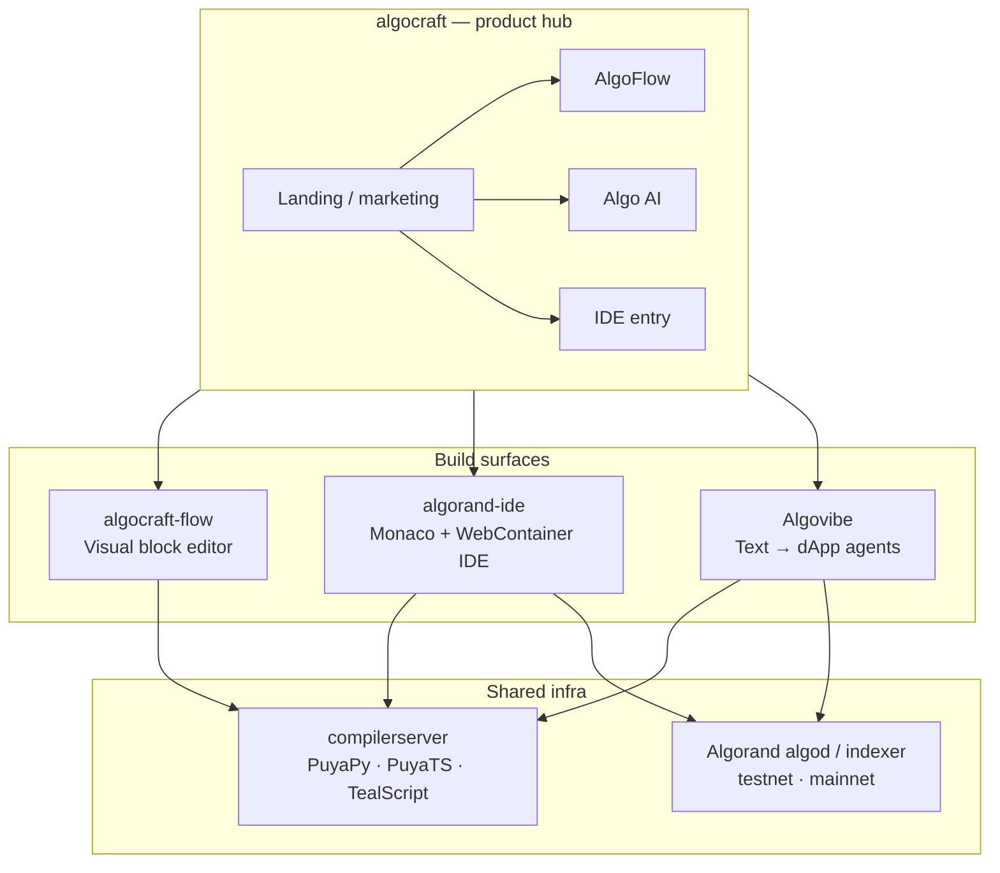
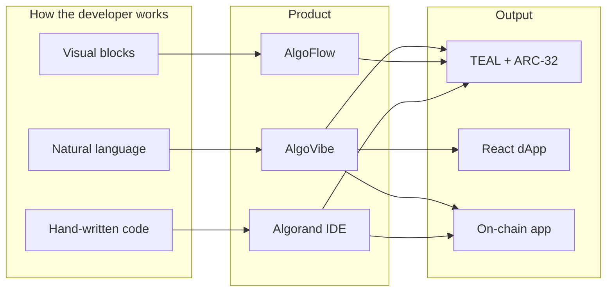
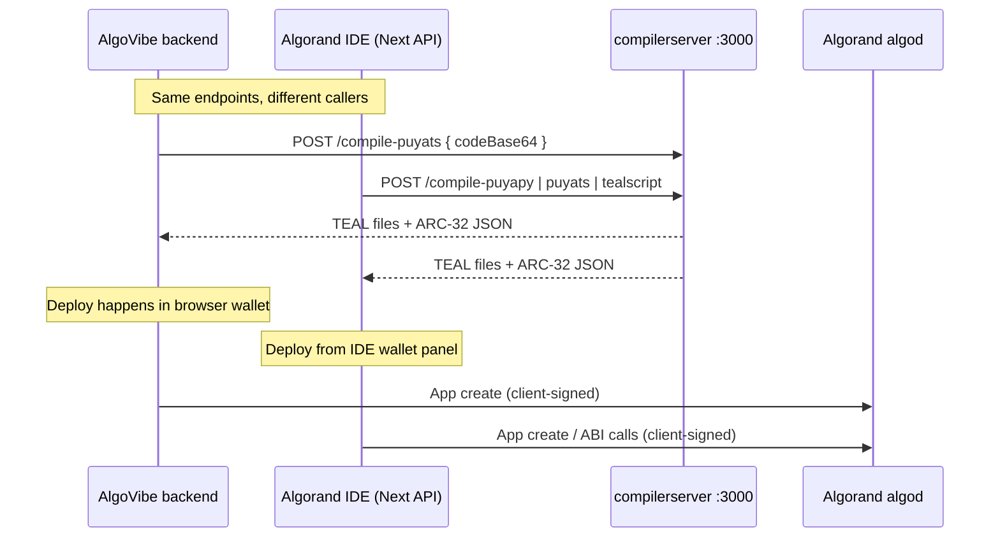

# AlgoVibe ecosystem & agent architecture

This document explains how **AlgoVibe** fits into the broader **Hackseries3 / AlgoCraft** workspace, how sibling projects connect, and how AlgoVibe’s agents work together end-to-end.

---

## Table of contents

1. [Hackseries3 at a glance](#1-hackseries3-at-a-glance)
2. [How the projects relate](#2-how-the-projects-relate)
3. [Shared infrastructure: compiler server](#3-shared-infrastructure-compiler-server)
4. [AlgoVibe in one picture](#4-algovibe-in-one-picture)
5. [Agent pipeline (deep dive)](#5-agent-pipeline-deep-dive)
6. [Two-phase deploy & build store](#6-two-phase-deploy--build-store)
7. [Post-generation quality layer](#7-post-generation-quality-layer)
8. [Frontend: preview, bridge, wallet](#8-frontend-preview-bridge-wallet)
9. [AlgoVibe vs IDE vs Flow](#9-algovibe-vs-ide-vs-flow)
10. [Configuration map](#10-configuration-map)
11. [File → responsibility quick reference](#11-file--responsibility-quick-reference)

---

## 1. Hackseries3 at a glance

The parent folder `Hackseries3/` is a **multi-product Algorand developer suite**. Each repo targets a different way to build on-chain apps; **AlgoVibe** is the natural-language, agent-orchestrated path.

| Project | Path | Role |
|---------|------|------|
| **algocraft** | `../algocraft` | Marketing hub; routes users to AlgoFlow, Algo AI, and IDE experiences |
| **algocraft-flow** | `../algocraft-flow` | **AlgoFlow** — drag-and-drop / node-based contract & transaction builder |
| **algorand-ide** | `../algorand-ide` | **Algocraft IDE** — full in-browser IDE (Monaco, WebContainer, wallet, build/deploy) |
| **Algocraft-ide** | `../Algocraft-ide` | Sibling / variant of the IDE codebase (same family as `algorand-ide`) |
| **compilerserver** | `../compilerserver` | **Unified compiler API** — Docker service for Puya + TealScript |
| **Algovibe** | `.` (this repo) | **AI text-to-dApp** — multi-agent pipeline, SSE streaming, Sandpack live preview |
| **docs** | `../docs` | Legacy **OneMove** (Move / OneChain) documentation from an earlier stack iteration |

AlgoVibe reuses the **same agent pattern** as OneMove (architect → contract agent → compile → react → preview), but targets **Algorand (Puya)** instead of Move.

---

## 2. How the projects relate

### Responsibility split

| Concern | AlgoFlow | Algorand IDE | AlgoVibe |
|---------|----------|--------------|----------|
| Primary input | Nodes / blocks | Source files in editor | Chat prompt (+ optional protocol chips) |
| AI | Limited / codegen helpers | AI chat + RAG (OpenRouter) | **Core** — Architect, Contract, React agents |
| Compile | Via compiler API | `app/api/compile` → compiler | `compiler_client.py` → compiler |
| Deploy | Wallet in Flow UI | Build toolbar + wallet | **Two-phase**: backend pauses → user signs in parent app |
| Preview | Code preview panels | WebContainer terminal | **Sandpack iframe + bridge** |
| Best for | Teaching flows, visual TX groups | Professional editing, templates | Fast hackathon demos, idea → working dApp |

### Data flow between repos (compile path)

Both **AlgoVibe** and **Algorand IDE** call the same style of HTTP compiler:

**AlgoVibe-specific choice:** deployment is **never** done with a server hot wallet for the user’s app. After compile, the pipeline **stops** at `sign_required`; the Next.js app builds the application-create transaction and the user signs with Pera / Defly / etc. (same security model as the IDE, different UX timing).

---

## 3. Shared infrastructure: compiler server

**Location:** `../compilerserver`  
**Run:** Docker image `unified-compiler`, port **3000** by default.

| Endpoint | Framework | AlgoVibe `framework` value |
|----------|-----------|----------------------------|
| `POST /compile-puyapy` | Puya Python | `puyapy` |
| `POST /compile-puyats` | Puya TypeScript | `puyats` (default) |
| `POST /compile-tealscript` | TealScript | `tealscript` |
| `GET /health` | — | health check |

AlgoVibe wraps this in `backend/app/services/compiler_client.py` and maps compiler output to:

- `approval_teal` / `clear_teal`
- `arc32_spec` (ABI, global/local schema, method hints)

The IDE proxies the same service via `algorand-ide/app/api/compile/route.ts` (`NEXT_PUBLIC_COMPILER_API_URL`, often `https://compiler.algocraft.fun`).

---
### Sibling repos

| Repo | Entry doc |
|------|-----------|
| compilerserver | `../compilerserver/README.md` |
| algorand-ide | `../algorand-ide` + `../algocraft/IDE_GUIDE.md` |
| algocraft-flow | `../algocraft-flow/app/page.tsx` |
| algocraft hub | `../algocraft/data/platforms.ts` |

---
