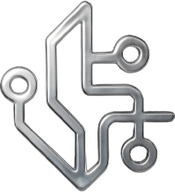

# AlgoVibe — Just Describe It. We'll Build It.

<p align="center">
  
</p>

<p align="center">
  <strong>The fastest way to go from "I have an idea" to a live Algorand DApp.<br/>No compiler setup. No Docker. No blockchain experience required.</strong>
</p>

<p align="center">
  🆓 Free & Open Source • 🎓 Built for Learners • 🚀 Rapid Prototyping • 🤝 Community-Driven
</p>

---

## Why AlgoVibe?

**Blockchain development is intimidating.** You hear about smart contracts, TEAL opcodes, ABI encoding, wallet signing, state schemas — and you haven't even written your first line of code yet.

Existing tools are powerful but assume you already know what you're doing. They need Docker, compiler servers, MCPs, local knowledge bases, and CLI fluency. That's great for experienced devs, but it locks out the exact people who *want* to learn.

**AlgoVibe removes that entire barrier.**

You type what you want in plain English. We handle everything else — the smart contract, the compilation, the security checks, the frontend, the wallet wiring, and the live preview. You get a working DApp you can actually deploy to Algorand testnet, inspect the code, learn from it, and iterate on it.

This isn't about replacing professional tools. It's about giving you a **starting point that actually works** so you can learn by doing instead of learning by suffering through setup.

---

## Who Is This For?

- 🎓 **Students and self-taught devs** curious about blockchain but overwhelmed by the setup
- 💡 **Hackathon builders** who need a working prototype in hours, not days
- 🔄 **Web2 developers** exploring Web3 for the first time
- 🧪 **Anyone with an idea** who wants to see it running on-chain before committing to a full build
- 🤝 **Algorand community members** who want to experiment, learn, and ship

If you've ever thought "I want to build on Algorand but don't know where to start" — this is your starting point.

---

## How It Works (30 Seconds)

```
You type: "Build a voting app where people can vote on proposals"
     ↓
AI Architect understands your intent → creates a spec
     ↓
AI Contract Agent writes an Algorand smart contract (PuyaTS)
     ↓
Compiler turns it into TEAL (the language Algorand understands)
     ↓
Security Auditor checks for vulnerabilities
     ↓
You sign one transaction with your wallet (Pera / Defly)
     ↓
Contract goes live on Algorand testnet
     ↓
AI React Agent builds a full frontend for your DApp
     ↓
Live preview appears — you can click buttons and interact immediately
```

**That's it.** One sentence in, working DApp out. The whole thing streams in real-time so you can watch each step happen.

---

## Quick Start — Get Building in 2 Minutes

### What You Need

- A browser
- An API key from [OpenRouter](https://openrouter.ai/) (free tier available) or any supported LLM
- A wallet app like [Pera](https://perawallet.app/) (free, takes 30 seconds to set up)

### Steps

1. **Open AlgoVibe** → navigate to the chat interface
2. **Add your API key** → click the AI Settings icon (top right), paste your key
3. **Type your idea** → "Build a tip jar where people can send ALGO to the creator"
4. **Watch it build** → the pipeline streams each step live
5. **Connect your wallet** → click "Connect" when prompted, sign one transaction
6. **Play with your DApp** → the live preview lets you interact immediately

No terminal. No Docker. No compiler installation. No configuration files.

---

## What AlgoVibe Builds For You

From a single prompt, you get:

| What | Details |
|------|---------|
| **Smart Contract** | Algorand PuyaTS (TypeScript) or PuyaPy (Python) — compiled to TEAL |
| **ARC-32 Spec** | Standard ABI so any tool can interact with your contract |
| **Security Audit** | Automated checks for common vulnerabilities before you deploy |
| **Deployment** | Client-side signing — your keys never leave your device |
| **React Frontend** | Full dark-theme dashboard with wallet connection and all contract methods wired up |
| **Live Preview** | Interactive Sandpack iframe — click buttons, call methods, see results |
| **Path Verification** | Ensures your UI is correctly connected to your contract (no broken buttons) |

---

## AlgoVibe & VibeKit — Better Together

We're not competing with [AlgoKit VibeKit](https://github.com/algorandfoundation/algokit-cli). We're complementary.

| | AlgoVibe | VibeKit |
|---|---------|---------|
| **Goal** | Instant prototype from an idea | Full development environment |
| **Setup** | Zero (browser + API key) | Docker + AlgoKit CLI + MCP servers |
| **Best for** | First-time builders, hackathons, rapid experimentation | Production development, team workflows |
| **Output** | Working DApp + live preview | Professional project scaffold |
| **Learning curve** | None — type and go | Moderate — CLI and Docker knowledge |

**The intended flow:**
1. **Start with AlgoVibe** → validate your idea, see it work, learn the patterns
2. **Graduate to VibeKit** → when you're ready for production, use the full professional toolchain

We believe the Algorand ecosystem needs both — a low-barrier on-ramp *and* a professional development environment.

---

## What Happens Under the Hood

You don't need to understand this to use AlgoVibe, but if you're curious:

### The Agent Pipeline

AlgoVibe uses 5 specialized AI agents working in sequence:

1. **Architect Agent** — Reads your prompt, figures out what you're building (voting app? token? crowdfunding?), and creates a detailed spec with methods, state, and business rules.

2. **Algorand Agent** — Takes the spec and writes a real Algorand smart contract. Uses 15 categories of curated Algorand knowledge (storage patterns, transaction types, ARC standards, error fixes). If the compiler rejects it, the agent automatically fixes and retries up to 5 times.

3. **Security Auditor** — Scans the compiled contract for common attack vectors: missing access control, locked funds, unvalidated payments, integer underflow. For financial contracts, it runs an adversarial LLM review thinking like an attacker.

4. **React Agent** — Generates a complete, styled React frontend with every contract method wired to a UI button, wallet integration, state display, and error handling.

5. **Orchestrator** — Coordinates everything, manages retries, streams progress to your browser in real-time, and handles the two-phase deployment flow.

### Two-Phase Deployment (Your Keys, Your Control)

AlgoVibe never holds your private keys or signs transactions for you.

- **Phase 1:** The backend compiles your contract and prepares the deployment transaction
- **Phase 2:** Your browser builds the transaction, you sign it with your wallet, it goes on-chain

This is the same security model used by professional tools — we're a code generation service, not a custodian.

### Ecosystem Protocol Integration

When you're ready to compose with DeFi, AlgoVibe knows about real Algorand protocols:

- **Tinyman** — Token swaps and liquidity pools
- **Folks Finance** — Lending and borrowing
- **Algorand ASA** — Token creation and management
- **Gora Network** — Price oracle feeds

Select a protocol chip in the UI and it'll be integrated into your DApp with correct patterns and constraints.

---

## Supported Frameworks

| Framework | Language | When to Use |
|-----------|----------|-------------|
| **PuyaTS** (default) | TypeScript | Most intuitive for web devs |
| **PuyaPy** | Python | If you prefer Python |
| **TealScript** | TypeScript | Legacy compatibility |

All compile down to TEAL (Algorand's virtual machine language) via our hosted compiler — you don't install anything.

---

## Architecture (For the Curious)

```
┌─────────────────────────────────────────────────┐
│            YOU (Browser)                          │
│  Chat → type your idea                           │
│  Preview → interact with your DApp               │
│  Wallet → sign transactions (Pera/Defly)         │
└─────────────────────┬───────────────────────────┘
                      │ SSE Stream (real-time)
┌─────────────────────┴───────────────────────────┐
│            BACKEND (FastAPI + LangGraph)          │
│                                                   │
│  Architect → Algorand Agent → Compiler →          │
│  Security Auditor → React Agent → Path Verifier   │
│                                                   │
│  LLM: OpenRouter / Anthropic / Ollama / BYOK      │
│  Knowledge: 15 skill categories + protocol registry│
└─────────────────────┬───────────────────────────┘
                      │
┌─────────────────────┴───────────────────────────┐
│            EXTERNAL SERVICES                      │
│  • Compiler Server (hosted, no setup needed)      │
│  • Algorand Testnet/Mainnet (Algonode.cloud)      │
│  • LLM Provider (your API key)                    │
└──────────────────────────────────────────────────┘
```

---

## Tech Stack

### Backend
- **FastAPI** — async Python web framework
- **LangGraph** — state machine for multi-step agent orchestration
- **OpenAI/Anthropic SDK** — unified LLM client (supports 5+ providers)
- **ChromaDB** — vector store for RAG (Algorand documentation retrieval)
- **py-algorand-sdk** — Algorand blockchain interaction

### Frontend
- **Next.js 14** — React framework
- **Zustand** — lightweight state management
- **@codesandbox/sandpack-react** — live code preview in iframe
- **@txnlab/use-wallet-react** — Algorand wallet integration (Pera, Defly, Lute, WalletConnect)
- **algosdk** — Algorand JavaScript SDK
- **TailwindCSS** — styling

### Infrastructure
- **Docker Compose** — optional, for self-hosting the full stack
- **GitHub Actions** — CI/CD for Docker image builds
- **Vercel** — one-click publish for your generated DApps

---

## Project Structure

```
AlgoVibe/
├── backend/
│   ├── app/
│   │   ├── agents/          # The 5 AI agents (brain of the system)
│   │   ├── api/routes/      # HTTP endpoints (generate, publish, protocols)
│   │   ├── core/            # LLM client, config, logging
│   │   ├── services/        # Compiler, verifier, simulator, publisher
│   │   ├── protocols/       # Algorand ecosystem protocol registry
│   │   └── rag/             # Document retrieval system
│   ├── knowledge/           # Curated Algorand skills + vector store
│   └── requirements.txt
├── frontend/
│   ├── app/chat/            # Main chat interface
│   ├── components/          # UI components (chat, preview, settings, wallet)
│   ├── lib/                 # Store, API client, bridge protocol
│   └── package.json
├── docker-compose.yml       # One-command full-stack deployment
├── .env.example             # All config options documented
└── ECOSYSTEM.md             # How AlgoVibe fits in the AlgoCraft suite
```

---

## Configuration

Copy `.env.example` to `.env` and set your LLM key. That's the minimum.

```bash
# The only required config — pick one:
OPENROUTER_API_KEY=sk-or-...          # Free tier available at openrouter.ai
# OR
ANTHROPIC_API_KEY=sk-ant-...          # Claude direct access
# OR
OLLAMA_BASE_URL=http://127.0.0.1:11434  # Local LLM, completely free
```

Everything else has sensible defaults:
- Compiler: uses our hosted server (`compiler.algocraft.fun`)
- Network: testnet by default
- Database: JSON file (no PostgreSQL needed for development)

---

## Self-Hosting (Optional)

If you want to run everything locally:

```bash
cp .env.example .env
# Add your LLM key to .env

# Option A: Docker (easiest)
docker compose up --build
# → App: http://localhost:3000/chat
# → API: http://localhost:8000/health

# Option B: Manual
cd backend && pip install -r requirements.txt && uvicorn app.main:app --reload
cd frontend && npm install && npm run dev
```

**With free local LLM (no API key needed):**
```bash
docker compose --profile ollama up --build
docker exec -it algovibe-ollama-1 ollama pull llama3.2
# Set LLM_PROVIDER=ollama in .env
```

---

## API Endpoints

| Method | Path | What It Does |
|--------|------|--------------|
| POST | `/api/v1/generate` | Build a DApp from a prompt (streams progress) |
| POST | `/api/v1/finalize` | Resume after you sign the deploy transaction |
| POST | `/api/v1/fix-frontend` | Refine the UI without recompiling the contract |
| POST | `/api/v1/publish` | One-click deploy your DApp to Vercel |
| GET | `/api/v1/protocols` | List available Algorand ecosystem protocols |
| POST | `/api/v1/llm/validate` | Check if your API key works |
| GET | `/health` | Backend status |

---

## Examples — What You Can Build

Just type any of these:

- "Build a voting app where users vote on proposals and see results"
- "Create a crowdfunding contract with a goal and deadline"
- "Make a tip jar where anyone can send ALGO to the creator"
- "Build an NFT minting contract"
- "Create a token with fixed supply and transfer capability"
- "Build a simple escrow that releases funds when both parties agree"
- "Make a subscription service that charges monthly in ALGO"
- "Create a pay-per-call API using x402 micropayments"
- "Build a lottery where participants buy tickets and a random winner is picked"
- "Make a DAO treasury with proposal and voting mechanics"

Each one produces a complete, deployable DApp in under 2 minutes.

---

## Community & Contributing

AlgoVibe is **free and open source**, built for the Algorand community.

### Ways to Contribute

- 🐛 **Report bugs** — something broke? Open an issue
- 💡 **Suggest features** — what would make this better for new devs?
- 📝 **Add protocol integrations** — know an Algorand protocol? Add it to the registry
- 📚 **Improve knowledge base** — add skill files, fix documentation
- 🎨 **Frontend improvements** — make the UI more welcoming
- 🔒 **Security patterns** — add new audit checks

### Development

```bash
# Fork → clone → branch
git checkout -b feature/my-feature

# Make changes, test locally
cd backend && uvicorn app.main:app --reload
cd frontend && npm run dev

# Commit and PR
git push -u origin feature/my-feature
```

---

## Current Status

### ✅ Working Now
- Full AI pipeline: prompt → contract → compile → audit → deploy → frontend → preview
- Multi-framework support (PuyaTS, PuyaPy, TealScript)
- Automatic compile retry with smart error corrections (5 attempts)
- Security auditing (deterministic + LLM adversarial review)
- Client-side wallet signing (Pera, Defly, Lute)
- Live interactive preview (Sandpack)
- Frontend-only follow-up fixes ("make the buttons green")
- Protocol integration (Tinyman, Folks Finance, ASA, Gora)
- x402 micropayment protocol support
- One-click Vercel publish
- BYOK — bring your own LLM key
- Docker Compose deployment

### 🚧 Coming Soon
- Hosted version (no setup at all — just visit a URL)
- More protocol integrations
- Template gallery (community-contributed DApp templates)
- Tutorial mode (explains each step as it happens)
- Mainnet deployment flow

---

## Philosophy

1. **Zero friction** — if it requires a terminal command, we've failed
2. **Learn by doing** — see working code, understand patterns, then go deeper
3. **Your keys, your DApp** — we never touch your private keys
4. **Free for builders** — the Algorand ecosystem grows when the barrier to entry drops
5. **Complement, don't compete** — we're the on-ramp, not the highway

---

<p align="center">
  Built with ❤️ for the Algorand community<br/>
  <em>Lower the barrier. Grow the ecosystem. Ship faster.</em>
</p>
