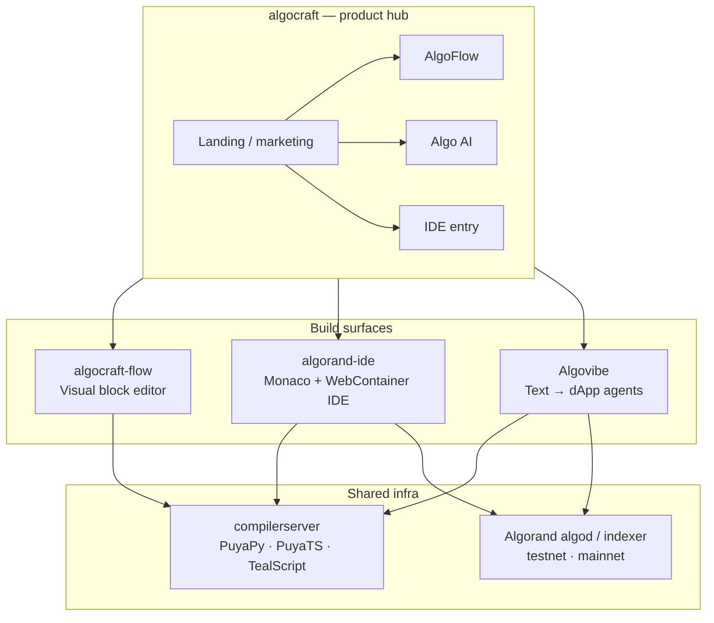
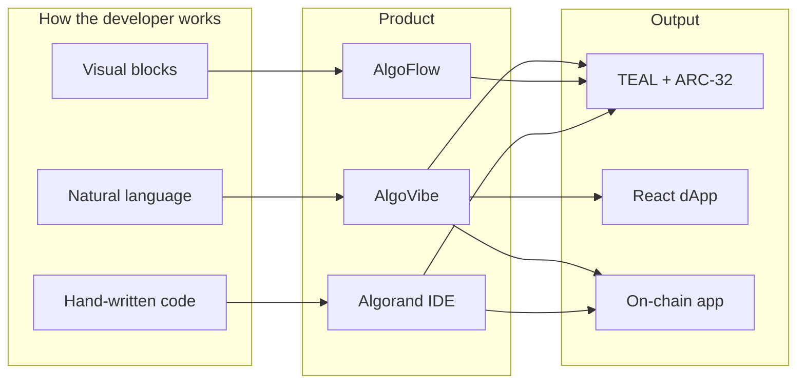
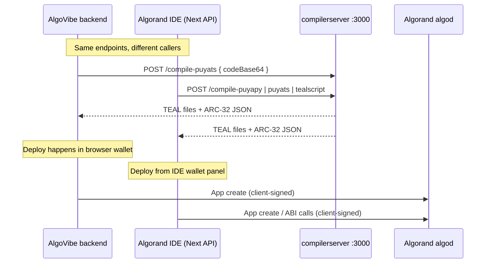
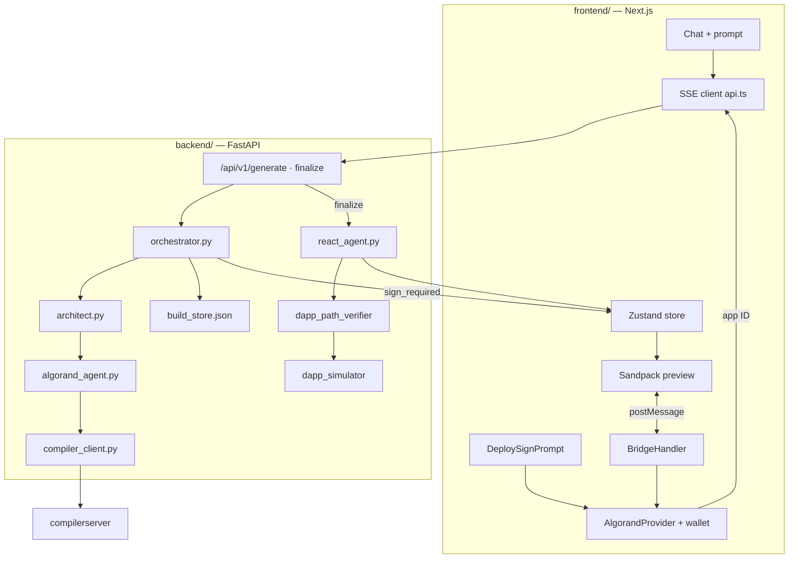
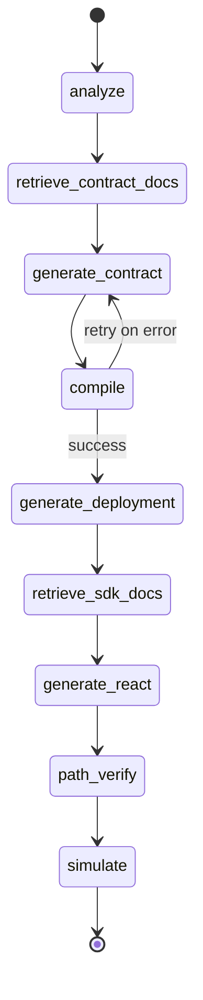
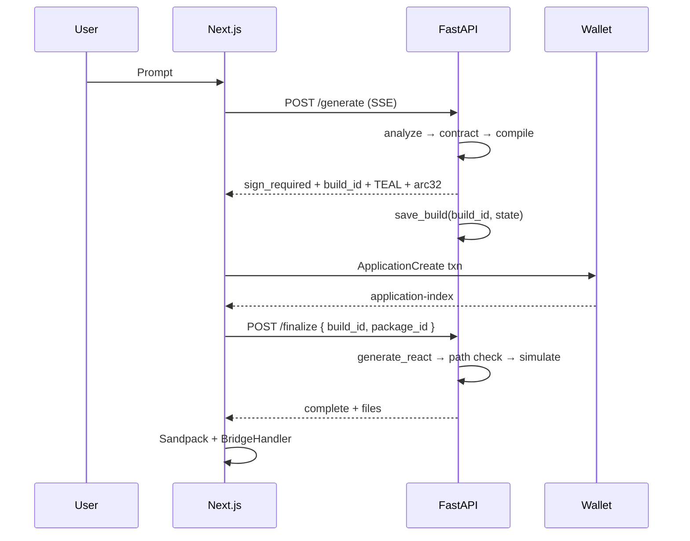
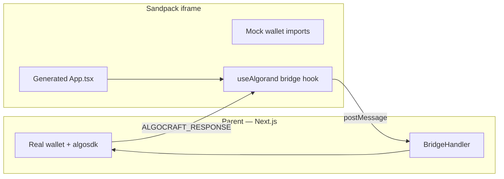

# AlgoVibe ecosystem & agent architecture

This document explains how **AlgoVibe** fits into the broader **Hackseries3 / AlgoCraft** workspace, how sibling projects connect, and how AlgoVibe’s agents work together end-to-end.

**Related:** [README.md](../README.md) · [ARCHITECTURE.md](../ARCHITECTURE.md) · [SETUP.md](SETUP.md) · [API.md](API.md) · [SMART_CONTRACTS.md](SMART_CONTRACTS.md)

---

## Table of contents

1. [Hackseries3 at a glance](#1-hackseries3-at-a-glance)
2. [How the projects relate](#2-how-the-projects-relate)
3. [Shared infrastructure: compiler server](#3-shared-infrastructure-compiler-server)
4. [AlgoVibe in one picture](#4-algovibe-in-one-picture)
5. [Agent pipeline (deep dive)](#5-agent-pipeline-deep-dive)
6. [Two-phase deploy & build store](#6-two-phase-deploy--build-store)
7. [Post-generation quality layer](#7-post-generation-quality-layer)
8. [Frontend: preview, bridge, wallet](#8-frontend-preview-bridge-wallet)
9. [AlgoVibe vs IDE vs Flow](#9-algovibe-vs-ide-vs-flow)
10. [Configuration map](#10-configuration-map)
11. [File → responsibility quick reference](#11-file--responsibility-quick-reference)

---

## 1. Hackseries3 at a glance

The parent folder `Hackseries3/` is a **multi-product Algorand developer suite**. Each repo targets a different way to build on-chain apps; **AlgoVibe** is the natural-language, agent-orchestrated path.



| Project | Path | Role |
|---------|------|------|
| **algocraft** | `../algocraft` | Marketing hub; routes users to AlgoFlow, Algo AI, and IDE experiences |
| **algocraft-flow** | `../algocraft-flow` | **AlgoFlow** — drag-and-drop / node-based contract & transaction builder |
| **algorand-ide** | `../algorand-ide` | **Algocraft IDE** — full in-browser IDE (Monaco, WebContainer, wallet, build/deploy) |
| **Algocraft-ide** | `../Algocraft-ide` | Sibling / variant of the IDE codebase (same family as `algorand-ide`) |
| **compilerserver** | `../compilerserver` | **Unified compiler API** — Docker service for Puya + TealScript |
| **Algovibe** | `.` (this repo) | **AI text-to-dApp** — multi-agent pipeline, SSE streaming, Sandpack live preview |
| **docs** | `../docs` | Legacy **OneMove** (Move / OneChain) documentation from an earlier stack iteration |

AlgoVibe reuses the **same agent pattern** as OneMove (architect → contract agent → compile → react → preview), but targets **Algorand (Puya)** instead of Move.

---

## 2. How the projects relate

### Responsibility split



| Concern | AlgoFlow | Algorand IDE | AlgoVibe |
|---------|----------|--------------|----------|
| Primary input | Nodes / blocks | Source files in editor | Chat prompt (+ optional protocol chips) |
| AI | Limited / codegen helpers | AI chat + RAG (OpenRouter) | **Core** — Architect, Contract, React agents |
| Compile | Via compiler API | `app/api/compile` → compiler | `compiler_client.py` → compiler |
| Deploy | Wallet in Flow UI | Build toolbar + wallet | **Two-phase**: backend pauses → user signs in parent app |
| Preview | Code preview panels | WebContainer terminal | **Sandpack iframe + bridge** |
| Best for | Teaching flows, visual TX groups | Professional editing, templates | Fast hackathon demos, idea → working dApp |

### Data flow between repos (compile path)

Both **AlgoVibe** and **Algorand IDE** call the same style of HTTP compiler:



**AlgoVibe-specific choice:** deployment is **never** done with a server hot wallet for the user’s app. After compile, the pipeline **stops** at `sign_required`; the Next.js app builds the application-create transaction and the user signs with Pera / Defly / etc. (same security model as the IDE, different UX timing).

---

## 3. Shared infrastructure: compiler server

**Location:** `../compilerserver`  
**Run:** Docker image `unified-compiler`, port **3000** by default.

| Endpoint | Framework | AlgoVibe `framework` value |
|----------|-----------|----------------------------|
| `POST /compile-puyapy` | Puya Python | `puyapy` |
| `POST /compile-puyats` | Puya TypeScript | `puyats` (default) |
| `POST /compile-tealscript` | TealScript | `tealscript` |
| `GET /health` | — | health check |

AlgoVibe wraps this in `backend/app/services/compiler_client.py` and maps compiler output to:

- `approval_teal` / `clear_teal`
- `arc32_spec` (ABI, global/local schema, method hints)

The IDE proxies the same service via `algorand-ide/app/api/compile/route.ts` (`NEXT_PUBLIC_COMPILER_API_URL`, often `https://compiler.algocraft.fun`).

---

## 4. AlgoVibe in one picture



**Product name in UI:** often **AlgoCraft**; repo folder **Algovibe**. Same codebase.

---

## 5. Agent pipeline (deep dive)

### Orchestrator

**File:** `backend/app/agents/orchestrator.py`

The orchestrator is a **LangGraph-shaped** state machine (`PipelineState`) with a **custom streaming loop** for:

- compile retries (up to **5**)
- **pause** after compile for wallet deploy
- resume on `/finalize` with real `app_id`

Logical graph (full run after finalize):



**Phase 1 (`run_pipeline`)** runs through compile + deployment code generation, then **returns** (does not run `generate_react`).

**Phase 2 (`run_pipeline_finalize`)** loads `build_store`, sets `app_id`, runs `generate_react_node` only.

### Agent 1 — Architect

| | |
|---|---|
| **File** | `backend/app/agents/architect.py` |
| **Input** | User prompt (+ protocol JSON appended by frontend if chips selected) |
| **Output** | `AnalysisResult`: `template_type` + `spec` |
| **LLM role** | Product manager + solutions architect for Algorand |

The spec is the **contract of record** for all downstream agents:

- `global_state` / `local_state` / `box_storage`
- `methods[]` with args, returns, `on_complete`
- `ui_requirements[]`, `business_logic[]`
- `template_type` ∈ `voting`, `crowdfunding`, `nft`, `dao`, `custom`, …

**Constraints enforced in prompt:** max ~3–5 ABI methods, Algorand types only, one UI action per method.

### Agent 2 — Algorand contract agent

| | |
|---|---|
| **File** | `backend/app/agents/algorand_agent.py` |
| **Class** | `AlgorandAgent(framework="puyats" \| "puyapy" \| "tealscript")` |
| **Input** | `contract_spec`, optional RAG docs, retry context |
| **Output** | `contract_code`, `filename` |

**Pipeline inside the agent:**

1. Load **skills** from `backend/knowledge/algorand-agent-skills/` (Puya patterns, storage, ITXN, etc.)
2. LLM generation with framework-specific system prompt + few-shots
3. **`_sanitize_code`** — deterministic regex fixes (e.g. strip `allowActions: 'OptIn'` on business methods when `optInToApplication` exists)
4. On compile failure: **`ERROR_CORRECTIONS`** pattern match → inject targeted fix block into retry prompt
5. Optional: **`agent_memory.json`** (`core/memory.py`) — learn from past compile errors

**Banned patterns (examples):** `sendPayment`, `gtxn[0]`, `bool` instead of `boolean`, `createApplication` with arguments.

### Agent 3 — Compiler (service, not LLM)

| | |
|---|---|
| **File** | `backend/app/services/compiler_client.py` |
| **Role** | HTTP client only — no generation |

Retries are orchestrator-driven: failed compile → increment `compile_retry_count` → regenerate contract with `error_context`.

### Agent 4 — React agent

| | |
|---|---|
| **File** | `backend/app/agents/react_agent.py` |
| **When** | Only after finalize (known `APP_ID`) |
| **Input** | spec, `arc32_spec`, deployed app id |
| **Output** | Sandpack file map |

**`build_file_structure()`** assembles:

| File | Purpose |
|------|---------|
| `/App.tsx` | LLM-generated UI (inline styles, dark dashboard) |
| `/hooks/useContract.ts` | Auto-generated from ARC-32 method list |
| `/hooks/useAlgorand.ts` | Bridge template (patched again on frontend) |
| `/hooks/useContractState.ts` | Read helpers |
| `/contract.arc32.json` | ABI for bridge + deploy |
| `/index.css` | Base styles |

Lifecycle methods (`createApplication`, `optInToApplication`, …) are **excluded** from `useContract`; opt-in uses magic method `__optIn__` via the bridge.

### RAG nodes (optional / stubbed)

| Node | Status |
|------|--------|
| `retrieve_contract_docs_node` | Simulated delay; returns `[]` in demo |
| `retrieve_sdk_docs_node` | Same |
| `backend/app/rag/` | Embeddings + retriever ready to wire |

Re-enabling RAG: call `retrieve_docs()` from retriever in orchestrator nodes and index docs via `backend/scripts/index_algorand_docs.py`.

### Protocol enrichment (not a separate agent)

**File:** `backend/app/protocols/registry.py`

Frontend loads `GET /api/v1/protocols`; selected chips append structured JSON (`integration_prompt`) to the user message so the **Architect** and **Algorand agent** see Tinyman, Folks, etc. constraints without a dedicated protocol LLM.

---

## 6. Two-phase deploy & build store

Wallet deploy is intentional: **private keys never touch the backend.**



**Persistence:** `backend/build_sessions.json` via `build_store.py` (TTL ~1 hour). Survives backend reload between sign and finalize.

---

## 7. Post-generation quality layer

These run **inside** `generate_react_node` after the React agent — they are not separate LLM agents.

### Path verifier (“maze check”)

**File:** `backend/app/services/dapp_path_verifier.py`

Traces wiring:

- ARC-32 methods ↔ `useContract.ts` ↔ buttons in `App.tsx`
- Opt-in / pay-method patterns
- Emits `path_check_complete` / `path_check_warning` SSE events

### Testnet simulator

**File:** `backend/app/services/dapp_simulator.py`

If `SIMULATE_ENABLED` and `ALGORAND_SIMULATOR_MNEMONIC` are set, runs happy-path **algod** calls against the deployed app id. Emits `simulation_complete`.

### Agent memory

**File:** `backend/app/core/memory.py` → `knowledge/agent_memory.json`

Cross-session learning from compile errors (optional enhancement to retries).

---

## 8. Frontend: preview, bridge, wallet

### Security model



| Message | Direction | Purpose |
|---------|-----------|---------|
| `CALL_METHOD` | iframe → parent | ABI app call; parent signs |
| `READ_STATE` | iframe → parent | Global + local state |
| `GET_ADDRESS` | iframe → parent | Connected address |
| `__optIn__` | special | OptIn txn + optional ABI selector |
| `ALGOCRAFT_EVENT` | parent → iframe | `WALLET_CHANGED` refresh |

**Key files:**

- `frontend/lib/bridge-protocol.ts` — types
- `frontend/lib/preview-bridge-hooks.ts` — canonical iframe hook; `patchPreviewBridgeFiles()` on complete
- `frontend/components/preview/BridgeHandler.tsx` — signing, ARC-32 `onComplete`, bigint-safe `sameAppId`
- `frontend/components/preview/DeploySignPrompt.tsx` — app create before preview
- `frontend/lib/store.ts` — `sendPrompt`, `completeDeployment`, build status machine

### Export vs preview

| | Preview | Export zip |
|---|---------|------------|
| Wallet | Parent bridge | Real `useWallet` in `export-templates.ts` |
| Keys in generated code | Never | Never |

---

## 9. AlgoVibe vs IDE vs Flow

```mermaid
quadrantChart
  title Build approach (conceptual)
  x Low manual coding --> High manual coding
  y Low AI automation --> High AI automation
  quadrant-1 Hybrid
  quadrant-2 IDE-first
  quadrant-3 Flow-first
  quadrant-4 AI-first
  AlgoVibe: [0.85, 0.9]
  Algorand IDE: [0.75, 0.35]
  AlgoFlow: [0.25, 0.2]
```

| Question | Use **AlgoVibe** | Use **Algorand IDE** | Use **AlgoFlow** |
|----------|------------------|----------------------|------------------|
| “I have an idea in English” | ✓ | | |
| “I need to edit TEAL/Puya line by line” | | ✓ | |
| “I want to teach transaction groups visually” | | | ✓ |
| “I need compile + ARC-32 only” | ✓ (via API) | ✓ | partial |
| “I want live React preview without leaving the page” | ✓ Sandpack | WebContainer | limited |

**algocraft** landing is the **front door**; **AlgoVibe** is the flagship **generative** product in this monorepo layout.

---

## 10. Configuration map

| Variable | Used by | Purpose |
|----------|---------|---------|
| `COMPILER_SERVER_URL` | AlgoVibe backend | Puya compile HTTP base |
| `OPENROUTER_API_KEY` / `ANTHROPIC_API_KEY` | Agents | Server-side LLM |
| `NEXT_PUBLIC_API_URL` | Frontend | FastAPI base |
| `ALGORAND_*_URL` | Bridge, simulator | algod / indexer |
| `SIMULATE_ENABLED`, `ALGORAND_SIMULATOR_MNEMONIC` | Simulator | Post-deploy checks |
| `NEXT_PUBLIC_COMPILER_API_URL` | Algorand IDE only | IDE compile proxy |

Local minimal stack for AlgoVibe:

1. `compilerserver` on `:3000` (or remote URL)
2. `uvicorn` backend `:8000`
3. `npm run dev` frontend `:3000` (Next — different port from compiler; set URLs accordingly)

---

## 11. File → responsibility quick reference

### Backend agents & pipeline

| File | Role |
|------|------|
| `agents/orchestrator.py` | Stream pipeline, sign pause, finalize, retries |
| `agents/architect.py` | Prompt → JSON spec |
| `agents/algorand_agent.py` | Spec → Puya source + sanitizer |
| `agents/react_agent.py` | Spec + app id → React + hooks |
| `services/compiler_client.py` | compilerserver HTTP |
| `services/build_store.py` | Phase-1 ↔ phase-2 session |
| `services/dapp_path_verifier.py` | UI ↔ contract wiring audit |
| `services/dapp_simulator.py` | Testnet happy path |
| `api/routes/generate.py` | SSE `/generate`, `/finalize` |

### Frontend

| File | Role |
|------|------|
| `lib/store.ts` | Build state machine |
| `lib/api.ts` | SSE parsers |
| `components/preview/SandpackPreview.tsx` | Iframe bundler + import shims |
| `components/preview/BridgeHandler.tsx` | Parent-side signing |
| `components/preview/DeploySignPrompt.tsx` | App create + finalize trigger |

### Sibling repos

| Repo | Entry doc |
|------|-----------|
| compilerserver | `../compilerserver/README.md` |
| algorand-ide | `../algorand-ide` + `../algocraft/IDE_GUIDE.md` |
| algocraft-flow | `../algocraft-flow/app/page.tsx` |
| algocraft hub | `../algocraft/data/platforms.ts` |

---

## End-to-end user journey (summary)

1. User opens **AlgoVibe** `/chat`, connects testnet wallet.
2. Prompt → **Architect** spec → **Algorand agent** source → **compiler server** TEAL/ARC-32.
3. Pipeline pauses → user signs **app create** → `finalize` with app ID.
4. **React agent** builds UI + hooks → path check → optional simulation.
5. **Sandpack** runs generated app; **BridgeHandler** signs real transactions from the parent wallet.
6. User may **export** a standalone Vite project or publish via Vercel routes (optional).

For implementation detail on bridge messages, ARC-32 opt-in rules, and SSE event lists, see [ARCHITECTURE.md](../ARCHITECTURE.md) and [API.md](API.md).

---

*Last updated for the Hackseries3 AlgoCraft suite — AlgoVibe agents, two-phase deploy, and shared compiler integration.*
