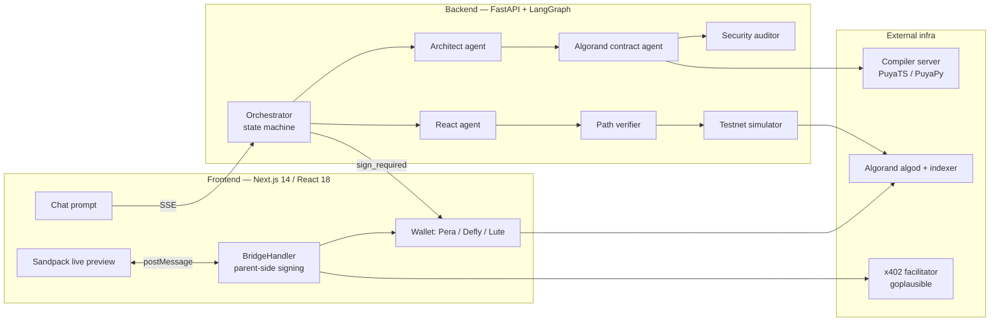
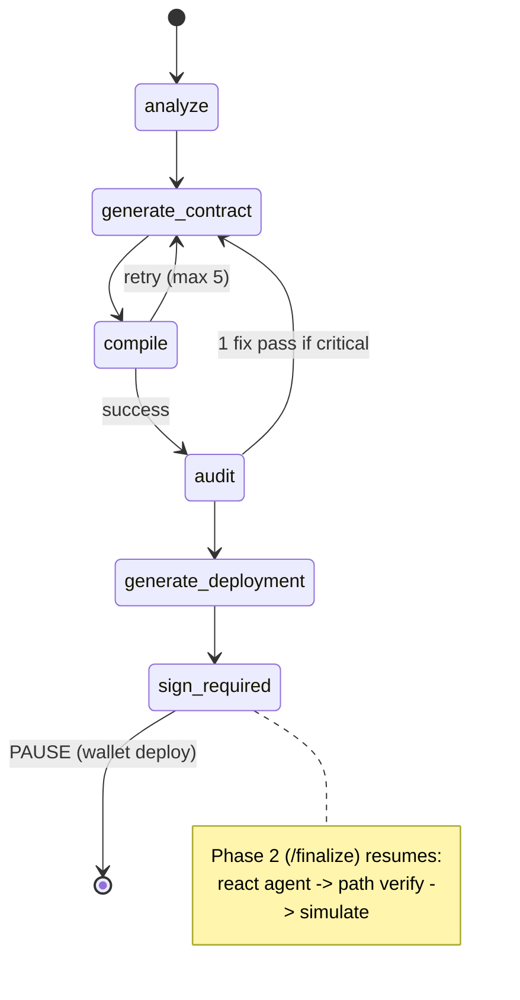

# Panel 1 — TECHNICAL (30% weight)

> Audience: software engineers, architects, blockchain developers
> Format: 3 min present + 2 min Q&A. Have GitHub repo **and** live demo already open.

---

## 0. One-line technical pitch

> **AlgoVibe turns an English prompt into a compiled, security-audited Algorand smart contract plus a live React dApp — using a 5-agent pipeline, an external Puya compiler, automated wiring verification, and a wallet-signed (never server-custodied) deploy.**

---

## 1. What to have open before you sit down

| Tab | URL / path | Why |
|-----|------------|-----|
| GitHub repo | repo root | Show clean monorepo structure |
| Live app | `http://localhost:3000/chat` | Run a real generation |
| Backend health | `http://localhost:8000/health` | Proves backend is live, shows model + network |
| Architecture diagram | `ECOSYSTEM.md` (mermaid renders on GitHub) | Already drawn — section 4 + 5 |
| `backend/app/agents/orchestrator.py` | the pipeline state machine | This is your "critical component" walkthrough |

---

## 2. System architecture (use this diagram)



**Frontend → Backend → Blockchain** in one sentence: the browser streams a prompt over SSE to FastAPI; FastAPI orchestrates LLM agents + an external compiler; the compiled contract is deployed by the **user's own wallet**; the generated React app runs in a Sandpack sandbox and signs real transactions through a postMessage bridge to the parent wallet.

---

## 3. The pipeline (your live code walkthrough — 5 to 10 min)

Open `backend/app/agents/orchestrator.py`. This is a **LangGraph `StateGraph`** with a custom streaming loop.



Talking points while scrolling the file:

- **`PipelineState` (TypedDict)** — single typed state object threaded through every node. Point at it; it shows clean state management.
- **`MAX_COMPILE_RETRIES = 5`** — the orchestrator feeds compiler errors back into the contract agent with truncated error context (`error_ctx[:500]`) to prevent prompt snowballing.
- **Loop guard** — if the *same* compile error repeats 3× it bails with a clear message instead of burning tokens (`len(set(last_errors[-3:])) == 1`).
- **Two-phase deploy** — pipeline **pauses** at `sign_required`, persists state to `build_sessions.json`, and resumes on `/finalize` once the user's wallet returns a real `app_id`. Private keys never touch the server.
- **Security audit gate** — after a successful compile, `audit_contract()` runs; one auto-fix regeneration pass is allowed, and if the fix breaks compilation it **reverts to the known-good snapshot** (`good_snapshot`).

---

## 4. The 5 agents (know each one)

| # | Agent | File | Role |
|---|-------|------|------|
| 1 | Architect | `agents/architect.py` | Prompt → JSON spec (`global_state`, `methods[]`, `ui_requirements`). Caps at 3–5 ABI methods. |
| 2 | Algorand contract agent | `agents/algorand_agent.py` | Spec → Puya source. Loads skills, runs `_sanitize_code` regex fixes, pattern-matches `ERROR_CORRECTIONS` on retry. |
| 3 | Security auditor | `agents/security_auditor.py` | Deterministic checks **+** LLM audit. |
| 4 | React agent | `agents/react_agent.py` | Spec + ARC-32 + app_id → `App.tsx`, `useContract.ts`, bridge hooks. |
| — | Compiler client | `services/compiler_client.py` | HTTP client to the Puya compiler (not an LLM). |

---

## 5. Security practices & auditing (be ready, judges love this)

`agents/security_auditor.py` runs **deterministic static checks** + an LLM pass. Deterministic checks include:

- `_check_access_control` — unprotected state-mutating methods
- `_check_integer_underflow` — unguarded subtraction on uint64
- `_check_fund_recovery` — locked-funds / no-withdraw patterns
- `_check_payment_validation` — payment txn sender/amount/rekey checks

Global invariants enforced via the **protocol registry prompt** (`protocols/registry.py`):

- Never assume `gtxn[0]` index — use typed accessors
- Always check `Global.groupSize` (group-spoofing defense)
- Assert `rekeyTo == ZeroAddress` on all Pay/Asset transfers
- Opt-in checks before ASA transfers

The contract agent also has **banned patterns** (`sendPayment`, `gtxn[0]`, `bool` vs `boolean`, `createApplication` with args).

> Honest line if asked about gaps: *"The auditor is a first-pass safety net — deterministic heuristics plus an LLM review. It is not a substitute for a professional audit before mainnet, and we surface that to the user."*

---

## 6. Testing & reliability (show this)

| Test asset | File | What it proves |
|------------|------|----------------|
| End-to-end pipeline harness | `backend/test_pipeline.py` | Streams the real SSE pipeline, captures spec → contract → TEAL → ARC-32 → frontend, saves JSON to `test_outputs/`. |
| Wiring analyzer | `backend/test_pipeline_wiring.py` | Builds the **UI → hook → ABI** call graph and reports a **% UI coverage** + dead-wire issues. |
| Captured runs | `backend/test_outputs/*.json` | Real recorded x402 service generations (June 2026). |
| Path verifier (runtime) | `services/dapp_path_verifier.py` | Every generation traces UI→contract routes; emits `path_check_complete` / `path_check_warning`. |
| Testnet simulator (runtime) | `services/dapp_simulator.py` | Optional happy-path algod calls against the deployed app id. |

**Honest framing:** *"We don't have classic unit tests for every function. Instead we built two things that matter more for a code-generator: an end-to-end harness that runs the whole pipeline, and an automated wiring verifier that catches the #1 failure mode of AI codegen — UI buttons wired to nothing. It reports a coverage percentage per build."*

Demo command (if asked to prove it):
```bash
cd backend
python test_pipeline_wiring.py "Build a voting app"
# → prints contract methods, hook bindings, App.tsx call sites, and UI coverage %
```

---

## 7. Smart contracts & x402 implementation

**Contracts:** Puya (TypeScript default `puyats`, also `puyapy`, legacy `tealscript`) → compiled to **TEAL + ARC-32** by the external compiler. ARC-32 drives auto-generated `useContract.ts` hooks.

**x402 (HTTP 402 pay-per-call) — spec-compliant on Algorand TestNet:**
- `x402-server/` is a Hono server that returns **402 Payment Required**, then verifies USDC payment via the `facilitator.goplausible.xyz` facilitator.
- `backend/app/api/routes/x402_proxy.py` does the real round trip: it shells out to `@x402/fetch` + `@x402/avm` (Node via `tsx`) using a funded TestNet hot wallet, because the Sandpack iframe can't reach localhost and the browser can't hold a signer.
- Flow: `GET /api/data` → `402 + price` → sign USDC → retry with `X-PAYMENT` → facilitator verifies on-chain → response.

> Why blockchain here (technical version): payment **is** the auth — no API keys, no sessions, settlement is on-chain and verifiable.

---

## 8. Deployment & infrastructure

- **`docker-compose.yml`** — one command brings up backend (`:8000`) + frontend (`:3000`); optional profiles for a bundled Puya `compiler` and bundled `ollama`. Healthchecks on both services.
- **`.github/workflows/docker-build.yml`** — CI builds the Docker images.
- **Multi-provider LLM** (`core/config.py`): OpenRouter, Anthropic, AICredits, or local **Ollama** — plus **BYOK** (bring-your-own-key from the UI). No vendor lock-in.
- **Build session persistence:** `build_store.py` → `build_sessions.json` (TTL ~1h) survives a backend reload between the sign and finalize steps.

---

## 9. "How would you handle 10× users?" (prepared answer)

1. **Stateless backend** — the only state is `build_sessions.json` (swap for Redis/Postgres; `DATABASE_URL` already wired). Scale FastAPI horizontally behind a load balancer.
2. **LLM is the bottleneck, not us** — generation is I/O-bound on the model API. BYOK pushes per-user rate limits onto the user's own key; server keys can be pooled.
3. **Compiler is a separate stateless Docker service** — scale it independently; it's already split out.
4. **Blockchain reads** — use AlgoNode/indexer endpoints (already configured for testnet + mainnet); add caching for ARC-32 state reads.
5. **No custody** — because deploys are wallet-signed, we hold no keys and carry no custody risk at scale.

---

## 10. Q&A landmines + honest answers

| Question | Answer |
|----------|--------|
| "Is RAG actually wired?" | "No — it's stubbed for demo speed. The retriever/embeddings code exists in `backend/app/rag/` and can be re-enabled; we chose deterministic skills + few-shots for reliability." |
| "Real unit test coverage?" | "End-to-end harness + wiring verifier rather than per-function units. That's an honest gap; next step is pytest on the sanitizer and audit checks." |
| "Who signs deploys?" | "The user's wallet. The backend never holds keys for the user's app. The only hot wallet is a funded TestNet account used solely for the x402 demo payment." |
| "What if the model writes insecure code?" | "Deterministic auditor + one auto-fix pass + revert-on-break, plus banned-pattern sanitizer. We still tell users to get a real audit before mainnet." |
