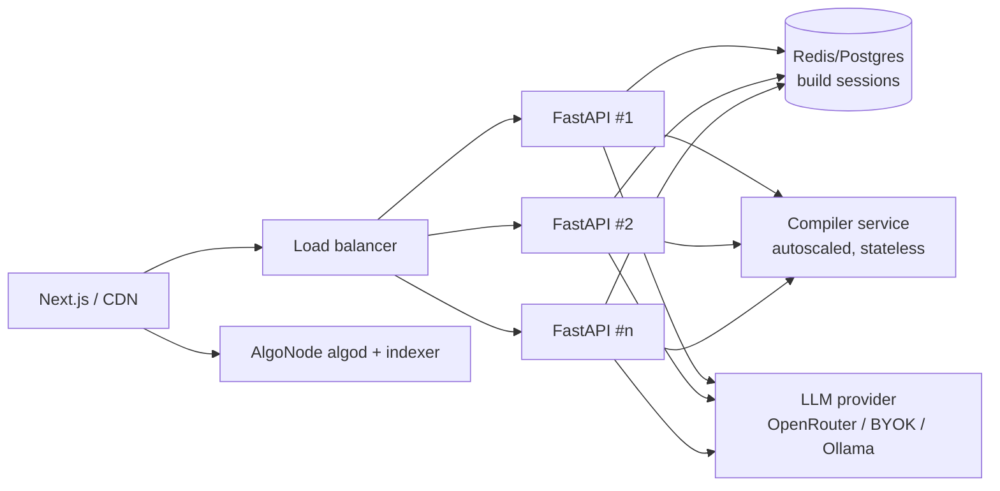

# Panel 3 — SCALABILITY & EXECUTION (30% weight)

> Audience: infrastructure architects, operations leaders, experienced founders
> Format: 3 min present + 2 min Q&A. They want **concrete**, not "go viral."

---

## 1. Go-to-market — specific, not "organic growth"

**Wedge: we are standing inside our own beachhead — the Algorand hackathon ecosystem.**

| Channel | Concrete action | Target |
|---------|-----------------|--------|
| Hackathons / grants | Demo at Algorand Foundation hackathons; submit to the grants program; be the "fastest path to a submission" | 30+ builders |
| University & dev clubs | Workshops: "ship an Algorand dApp in 10 minutes with AlgoVibe" | 20+ builders |
| Content / templates | Publish generated template gallery (voting, crowdfunding, NFT, DAO, x402 API) + tutorial threads | inbound devs |
| Ecosystem partnerships | Co-market with protocols already integrated: **Tinyman, Folks Finance, Gora** | qualified devs |
| x402 angle | Target indie devs/AI-tool builders who want to monetize an endpoint without billing infra | new segment |

---

## 2. First 100 users (name the sources)

> "30 from the Algorand hackathon cohort we're presenting to, 20 from university blockchain-club workshops, 20 from protocol partner communities (Tinyman/Folks Discord), 20 from x402 / pay-per-API indie-dev outreach, 10 from content/template gallery inbound."

That sums to **100 with named, reachable channels** — not "we'll go viral."

---

## 3. Architecture scalability — can it handle 10×?

Key scalability facts (all true of the current build):

- **Backend is near-stateless.** Only inter-request state is `build_sessions.json` via `build_store.py`. Swap the file store for **Redis/Postgres** (`DATABASE_URL` already in config) → horizontal scale behind a load balancer.
- **Compiler is a separate stateless Docker service** (`docker-compose.yml` `compiler` profile) → scale independently of the API.
- **LLM load is offloadable.** **BYOK** moves rate limits to each user's own key; managed users hit a pooled key set. The model API is the bottleneck, and it's elastic + not on our metal.
- **Frontend is static Next.js** → CDN/edge, trivially scalable.
- **No custody, no per-user infra at deploy time** — the user's wallet signs and submits; we don't run signing infra per user.

---

## 4. Data & indexer strategy (they will ask "how do you read chain data at scale?")

- Reads go through **AlgoNode** public algod + indexer, already configured for **testnet and mainnet** (`config.py`: `algorand_indexer_testnet/mainnet`).
- ARC-32 state reads in generated apps go through the bridge → algod; cacheable.
- **Scale path:** add a caching layer (Redis) for hot ARC-32 reads; if AlgoNode rate limits bite, move to a **dedicated indexer** (self-hosted Algorand indexer or a paid provider like Nodely/PureStake-style).
- **Failure plan:** indexer endpoints are configurable env vars — swap providers with zero code change.

---

## 5. Infrastructure & cost planning

| Component | Cost driver | Notes |
|-----------|-------------|-------|
| LLM inference | **Dominant cost** | Killed via BYOK (user pays) + caching. Managed tier priced to cover it. |
| Compiler service | CPU container | Cheap; stateless; scale to zero between bursts |
| Backend API | small containers | Stateless; cheap horizontal scale |
| Frontend | CDN | Negligible |
| Chain reads | AlgoNode free tier → paid | Only cost if we exceed free indexer limits |

> Soundbite: *"Our marginal cost per build is basically one LLM call plus one compile. With BYOK that's near-zero to us; the managed tier is priced to cover the model spend with margin."*

---

## 6. Third-party dependencies & risk mitigation (have the fallback ready)

| Dependency | Risk if it fails | Mitigation |
|------------|------------------|------------|
| LLM provider (OpenRouter/AICredits/Anthropic) | Generation stops | **Multi-provider abstraction** in `core/llm.py` + **local Ollama** fallback + BYOK. No single-vendor lock. |
| Compiler server | No contracts compile | Stateless + self-hostable (`compiler` profile); could run multiple instances / regions. |
| AlgoNode algod/indexer | Reads/deploys fail | Endpoints are env vars — swap to alternate provider or self-host indexer. |
| x402 facilitator (goplausible) | x402 payments unverifiable | x402 is one feature, not the core; facilitator URL is configurable; can run our own facilitator. |
| Wallet providers (Pera/Defly/Lute) | Deploy/sign UX breaks | Multiple wallets supported via `@txnlab/use-wallet`; degrade to another wallet. |

---

## 7. 6-month roadmap (clear milestones)

| Month | Milestone |
|-------|-----------|
| 1 | Harden pipeline; re-enable RAG; add pytest on sanitizer + auditor; first 100 users from hackathon/workshops |
| 2 | Managed tier + saved projects (Postgres-backed sessions); template gallery live |
| 3 | One-click Vercel publish GA (`vercel_publish.py`); protocol packs (Tinyman/Folks) polished |
| 4 | x402 monetization beta — usage fee on generated pay-per-call apps |
| 5 | Mainnet deploy flow + stronger audit (third-party audit partner integration) |
| 6 | Self-serve growth; indexer caching layer; SOC-style ops hardening |

---

## 8. Team capability (be honest per the brief)

Prepared framing:
> *"We're [web/AI/blockchain background]. Where we're strongest is [X]. Where we're newer is [Y] — and here's how we de-risk it: we lean on Algorand's official Puya toolchain, the algorand-agent-skills knowledge base we vendored into `backend/knowledge/`, and a deterministic auditor so we're not hand-rolling security from scratch."*

Don't bluff. "We're new to X, here's our learning plan" scores better than a fabricated answer.

---

## 9. Regulatory & compliance awareness

- **No custody** — we never hold user private keys for their app deploys → we avoid money-transmitter / custodial exposure on the core product.
- **x402 payments** settle wallet-to-wallet on-chain; **we are not in the funds path** for user deploys (only a small TestNet demo hot wallet).
- **KYC/AML:** the core dev tool doesn't onboard end-user funds. If the x402 take-rate model routes real value through us at scale, that's where KYC/AML and money-transmission rules would apply — **we acknowledge it and would structure the facilitator fee accordingly / use a licensed partner.**
- **Testnet-first** — default network is testnet; mainnet is opt-in and gated behind the audit warning.

> Honest soundbite: *"Today we're a non-custodial dev tool, so our regulatory surface is small. The moment we take a fee on real x402 settlement, money-transmission and KYC/AML questions appear — we know that and we'd partner with a licensed facilitator rather than wing it."*

---

## 10. "Handle 10× users" — one-paragraph answer

> *"The backend is stateless except for build sessions, which move to Redis/Postgres — so we scale FastAPI horizontally behind a load balancer. The compiler is already a separate stateless service we scale independently. The real load is the LLM, and BYOK plus a pooled managed key set keeps that elastic and off our hardware. Chain reads go through AlgoNode with a caching layer, swappable to a dedicated indexer. And because deploys are wallet-signed, 10× users doesn't mean 10× custody risk or 10× signing infra — it's just more reads and more model calls, both horizontally scalable."*
